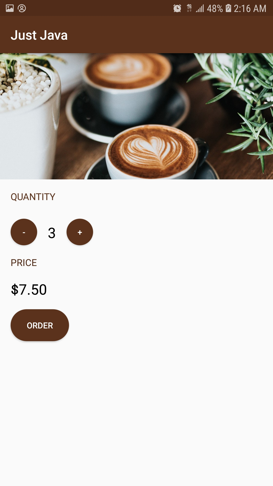

# Coffee ordering app concept

### Background:
* This is one of the first Android applications that I created. It is inspired by the Just Java app from the "Udacity Android for Beginners" course, which I was learning from at the time. The user is able to select the amount of coffee that they would like, with each cup being five dollars. Pressing the "order" button updates the total price. [Photo](https://unsplash.com/photos/zUNs99PGDg0) by Nathan Dumlao on Unsplash

